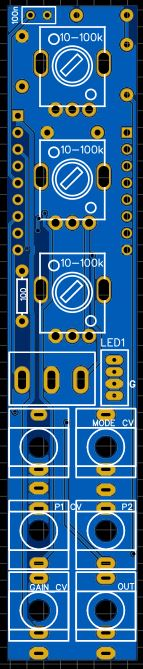

# HAGIWO 019/022/023 Triple Oscillator (FM/CHORD/ADDITIVE)
4HP through hole version of the HAGIWO FM/additive/chord oscillator with mode switch and gain input.

This module is basically my PCB version of [luis lutz HAGIWO oscillator module](https://github.com/luislutz/Arduino-VDCO).
The main difference is since I could not get his code to work without major audio problems, I rewrote the entire thing myself.

The module combines three different oscillators from HAGIWO,  with a mode switch (and mode cv input) to switch between them.
Additionally, it has a gain input that normals so that it is only used when you plug in a jack.

## STATUS: CONFIRMED WORKING. Took me a long time to figure out the code, but now everything works as intended (I think, if you encounter any problems let me know).

## Hardware and PCB

You can find the schematic and BOM in the root folder.
For the potentiometers, any value between 1k and 100k should be fine.

The module has three PCBs: a panel PCB, a main PCB and a controls pcb.
You can order them on any common PCB manufacturing service, I used JLCPCB. For the circuit PCB, standard settings should be fine.
For the panel, since it has copper exposed, make sure to choose a lead free surface finish (LeadFree HASL, ENIG) and/or spraypaint your panels so that you don't get lead on your hands.

Assembly is pretty straight forward. Since it is so crowded, make sure to do the resistors first before the headers so you have more space to work.

Also make sure to put the headers connecting both PCBs in the correct direction so that the arduino faces to the back.

The only thing there is to tune is a trimpot that sets output gain (as arduino is 0-5V output and I wanted to be able to make mine louder). Tune it to your liking.

Will upload build pictures later

